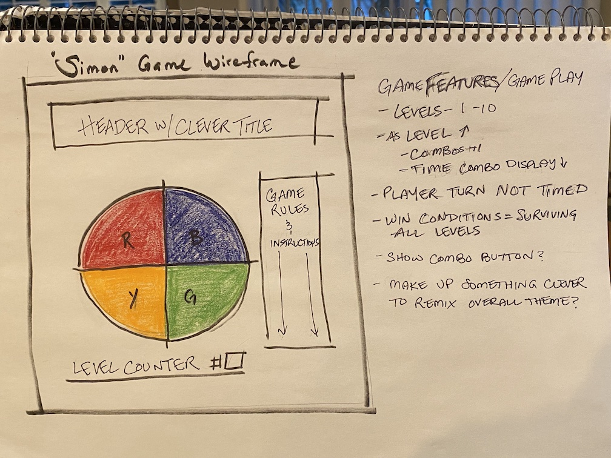

Simon Game README

WIREFRAME


background image source: https://openclipart.org/detail/319983/80s-neon-background#google_vignette

sound effects source: https://mixkit.co/free-sound-effects/game/

The Game- this game is patterned off of the classic children's game from the 1970s and 80s, SIMON. SIMON, originally released in 1978 by Milton Bradley(now HASBRO), tests the players short term memory by presenting them with a sequence of colors and sounds, and asks the player to repeat that sequence. As the game levels progress, the color sequence increases and the time with which the player has to repeat said sequence decreases, resulting in an increase of difficulty.

This version of SIMON takes a similar approach, indicating with on screen messaging when it is the players turn and when they should wait and observe. The game also notifies the player when they have made a wrong move and need to start again, or, in the case of playing out a number of levels (currently set to 10), when they have won.
```

TDLR the history lesson:

Game Play:
 players (2) = player vs. computer

 colorWheel changes colors on the wheel in a sequence, increasing in length as the levels progress

 Levels: 1, 2, 3, 4, 5, 6, 7, 8, 9, 10

 Win/lose conditions:
    - complete all 10 levels = win
    - make a mistake in pattern = lose